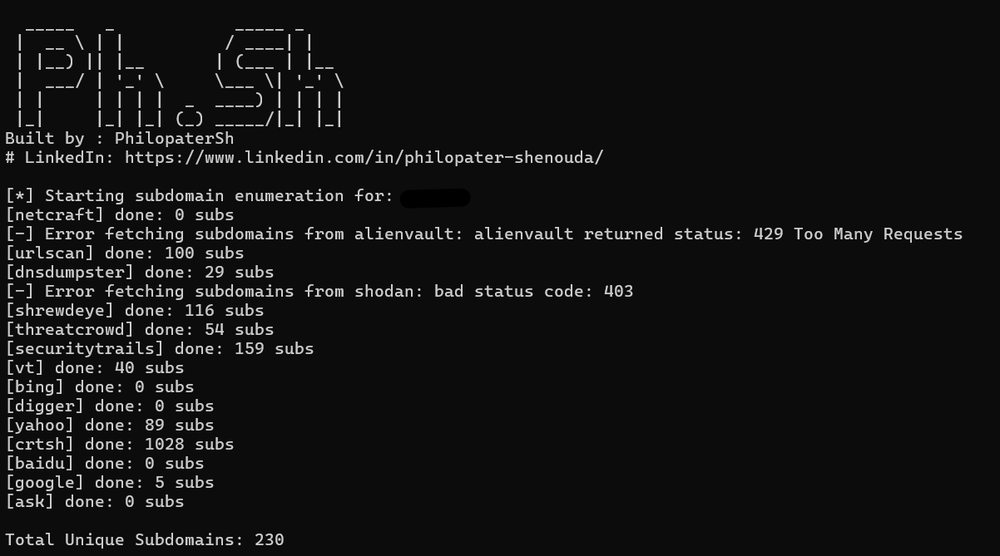

# SubHunter-Go

<p align="center">
  
</p>

<h3 align="center">A Fast and Concurrent Subdomain Enumeration Tool</h3>

<p align="center">
  <a href="https://goreportcard.com/report/github.com/PhilopaterSh/SubHunter-Ph.Sh"></a>
  <a href="https://github.com/PhilopaterSh/SubHunter-Ph.Sh/releases"></a>
</p>

---

SubHunter-Go is a fast and effective subdomain enumeration tool written in Go. It is designed to discover subdomains using a variety of passive sources, leveraging Go's concurrency for maximum speed and efficiency.

## Features

- **Concurrent Engine Execution**: Runs all engines in parallel for maximum speed.
- **Multiple Subdomain Sources**: Gathers results from the most reliable passive sources.
- **Email Discovery**: Gathers emails associated with the domain from supported engines (visible in verbose mode).
- **Flexible Input**: Supports scanning a single domain with `-d` or multiple domains from a file with `-dl`.
- **Clean & Unique Output**: Automatically processes, cleans, and de-duplicates results.
- **Cross-Platform**: Can be compiled to run on Windows, Linux, and macOS.

### Supported Engines

- AlienVault OTX
- Ask
- Baidu
- Bing
- Crt.sh
- Digger.tools
- DNSDumpster
- Google
- Netcraft
- SecurityTrails
- Shodan
- ShrewdEye
- **ThreatCrowd** (Restored)
- Urlscan.io
- VirusTotal
- Yahoo

## Requirements

- **Go**: Version 1.18 or newer (only required for installation or building from source).
- **Python**: Version 3.6+ is recommended. The `digger` engine requires Python and some external libraries. You can install them using pip:
  ```sh
  pip install -r requirements.txt
  ```

## Installation

The recommended way to install is using `go install`, which makes the command available globally from your terminal.

```sh
go install -v github.com/PhilopaterSh/Ph.Sh_Sub@latest
```

**Note:** This command will install the binary (named `Ph.Sh_Sub` or `Ph.Sh_Sub.exe`) into your Go binary path (e.g., `$GOPATH/bin` or `$HOME/go/bin`). Ensure this directory is in your system's `PATH` to run the tool from anywhere.

## Usage

Here are some examples of how to use SubHunter-Go:

*   **Scan a single domain:**
    ```sh
    Ph.Sh_Sub -d example.com
    ```

*   **Scan a list of domains from a file:**
    ```sh
    Ph.Sh_Sub -dl domains.txt
    ```

*   **Save results to a file:**
    ```sh
    Ph.Sh_Sub -d example.com -o results.txt
    ```

*   **Use verbose mode to see which engine found each subdomain and any discovered emails:**
    ```sh
    Ph.Sh_Sub -d example.com -v
    ```
    
*   **Handle SSL Certificate Errors:**
    Some servers (like ThreatCrowd) may have invalid SSL certificates. Use the `--no-ssl-verify` flag to bypass these errors.
    ```sh
    Ph.Sh_Sub -d example.com --no-ssl-verify
    ```

### All Options

```
Usage of SubHunter-Go:
  -d string
        Target domain (e.g., example.com)
  -dl string
        File containing a list of domains to scan
  -e string
        Comma-separated engines to run (e.g., crtsh,digger)
  -no-ssl-verify
        Disable SSL verification (insecure)
  -o string
        Save unique subdomains to file
  -t int
        Number of concurrent threads/goroutines (default 10)
  -v
        Show the engine that found each subdomain and any discovered emails
  -bruteforce
        Enable DNS bruteforce
  -wordlist string
        Wordlist file for bruteforce
  -resolvers string
        File with DNS resolvers for bruteforce
```


## Configuration

SubHunter-Go can load API keys from a configuration file named `Ph.Sh_Sub_config.yaml`.

Upon first run, if `Ph.Sh_Sub_config.yaml` is not found, a template file will be created in the platform-specific user configuration directory (e.g., `~/.config/Ph.Sh_Sub/Ph.Sh_Sub_config.yaml` on Linux, `C:\Users\YourUser\.config\Ph.Sh_Sub\Ph.Sh_Sub_config.yaml` on Windows).

**Example `Ph.Sh_Sub_config.yaml`:**

```yaml
api_keys:
  urlscan: "YOUR_URLSCAN_API_KEY"
  dnsdumpster: "YOUR_DNSDUMPSTER_API_KEY"
  vt: "YOUR_VT_API_KEY"
  securitytrails: "YOUR_SECURITYTRAILS_API_KEY"
  shodan: "YOUR_SHODAN_API_KEY"
```

Please edit this file and replace the placeholder values with your actual API keys. Only engines with a valid API key will be used.

## Version

The version of the tool can be seen at startup. The version is embedded into the binary at build time using the following command:

```sh
go build -ldflags="-X main.version=v2.5" -o Ph.Sh_Sub.exe
```